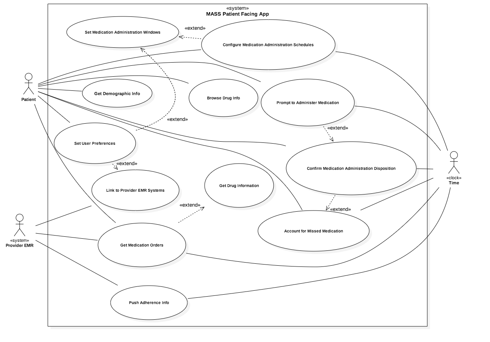

# Medication Adherence Support System -  Patient Facing App (MASS-PFA) Use Case Model

**Revised December 2, 2016 - Various Edits and Cleanup** 
**CS6440 - Fall Term 2016**

**Author(s) Team FHIR Stop -**

- Arnab Barua (GITD: abarua6, arnabtbarua@gmail.com) 
- Adam Hachey (GTID: ahachey3, arhachey@gmail.com) 
- Mark Mullison (GTID: mmullison3, mmullison@gmail.com) 
- Dominick Roselli (GTID: droselli3, eazysneazy@gmail.com)
- Jiankun Sun (GTID: jsun321, sunjiankun02@gmail.com) 

## 1 Use Case Diagram

 

## 2 Use Case Descriptions

###2.1 Use Case: Set User Preferences (SUP)  
**Pre-conditions:** None  
**Post-conditions:** All settings specified are committed to persistence layer and in effect  

**Description: As a patient, I want to be able to set my user preferences for the application**

**Scenario 1** - Create and modify parameters of connections to provider EMR systems via FHIR 
######Flow
1. Show a list of all currently configured connections
2. Allow selection of one of the currently configured connections, or to create a new one
3. Allow editing/creation of link as Use Case 2.2, Scenario 1

**Scenario 2** - Set time preferences for taking medications 
The idea here is to establish "windows" for taking meds that could be used/selected optionally when setting up actual schedules for taking meds.  In other words, I want to take my meds at 7:00 a.m. and call that "Morning" and at 7:00 p.m. and call that "After Dinner" and be able to select those rather than have to pick a time for each med. 
######Flow
1. Offer a list of existing "windows" for taking meds
2. Allow users to adjust existing windows or create a new one and give it a name

###2.2 Use Case: Link to Provider EMR Systems (LPEMRS)
**Pre-conditions:**   -None-  
**Post-conditions:**  Link is tested and configured or alternatively is not configured and user is alerted

**Description: As a patient, I want to be able to configure the app to use my health care provider's EMR system** 

#####Scenario 1 - Establish Link and Configure Data Sharing Preferences  
######Flow  
1. Configure link  
2. Verify link works 
3. Test for Provider EMR support of features
3. Offer options that are supported to patient and ask them to choose what information can flow between App and Provider EMR

###2.3 Use Case: Get Medication Orders (GMO)
**Pre-conditions:**  User has successfully configured at least one Provider EMR system for interaction   
**Post-conditions:** Any medication orders in any linked Provider EMR system are in the app

**Description: As a patient, I want to get my medication orders from my health records with my providers**    

######Flow  
1. Once a day, poll all EMR systems that the app is connected to for active medication orders 
2. If there are new orders that aren't configured in App, notify the patient and ask them to schedule them for administration (or snooze and do it 4 hours later, or dismiss entirely with "Are you sure?" warning).  If they agree to configure now then go to Use Case 2.4 with that med selected.
3. If any active meds don't have orders, prompt user to confirm deleting them from the schedule (but allow user to override and keep the schedule active).

###2.4 Use Case: Configure Medication Administration Schedules (CMAS)
**Pre-conditions:**   
**Post-conditions:**

**Description: As a patient, I want to configure my reminders for my prescribed medications**  

######Flow  
1. Show a list of all medication orders and configured meds
2. Allow user to select one and make changes
3. Confirm each change
4. Warn user before leaving if some medication orders don't have schedules for administration

###2.5 Use Case: Update App Drug Information (UADI)
**Pre-conditions:** One or more medication orders are present
**Post-conditions:** Information is updated, or if not, a warning is given to user

**Description: As a patient, I want the information about my Medications to be updated with the latest information.**  
######Flow  
1. Either on demand, or once a day, go to central database and download updated medication information for all prescribed medications.

###2.6 Use Case: Browse Medication Information (BMI)
Pre-conditions:  One or more medications orders are present
Post-conditions:  N/A

**Description: As a patient, I want access to information about the medications I'm taking.**  

######Flow  
1. If medication information isn't present, the update medication information (UADI 2.5)
2. Allow user to browse medication information including picture of the pill and general information about the drug including what it commonly prescribed for and also known side effects and drug interaction warnings.

###2.7 Use Case: Prompt to Administer Medication (PAM)
Pre-conditions:  Time to administer medication
Post-conditions: User has either "snoozed", confirmed the med is taken, or said they aren't taking the med.

**Description: As a patient, I want to be reminded when to take my medication.**  

######Flow  
1. At the appointed time, remind user that it's time to take his/her medication by displaying a pop-up whether the app is active or not.
2. Ask user to acknowledge alert and either:  
a. Snooze the alert  
b. Say they took the med, (in which case go to Use case 2.8 - CMAD below, or   
c. Say they aren't going to take/didn't take their med  
3. If (c) above, then go to Use case 2.9 (AMM) below.

###2.8 Use Case: Confirm Medication Administration Disposition (CMAD)
Pre-conditions:   
Post-conditions: 

**Description: As a patient, I want the date and time of my self-administered medications to be tracked.**  

###2.9 Use Case: Account for Missed Medication (AMM)
Pre-conditions:   
Post-conditions: 

**Description: As a patient, I want to be prompted to provide feedback as to why I didn't take my medication as scheduled.**  

###2.10 Use Case: Do Educational Intervention (DEI)
Pre-conditions:   
Post-conditions: 

**Description: As a patient, when I've missed my medication, I want to know how it can affect me.**  

###2.11 Use Case: Push Adherence Info (PAI)
Pre-conditions:   
Post-conditions: 

**Description: As a patient, I want to give one or more of my providers access to my medication adherence information.**  

###2.12 Use Case: Prompt to Refill Prescription (PRP)
Pre-conditions:   
Post-conditions: 

**Description: As the patient, I want to be reminded to refill my prescriptions before they're empty.**  

###2.13 Use Case: Get Demographic Info
Pre-conditions: None.  
Post-conditions: Information is stored in local SQLite database

**Description: As a patient, I want to be able to provide demographic information that might help to determine my medication adherence propensity and assist researchers in understanding medication adherence at the community level**

######Flow  
1. Provide fields for user to enter the following information:

	a. Primary language (if English secondary language).  
b. Education (grade completed) – estimator of health literacy.  
c. Number of people in household, and number of people under 18 years.  
d. Number of jobs – estimate of burdensome schedule.  
e. Visual, hearing ,or mobility impairment.  
f. Swallowing problems.  
g. Distance to nearest pharmacy and or health system that takes their insurance.  
h. Treatment interferes with lifestyle or requires significant behavioral change (self-report).  
i. Number of different providers seen in past year (categorical).  
j. Report that cost of medication is a concern (self-report).  
k. Number of vehicles in the family (or ratio vehicles to residents).  

